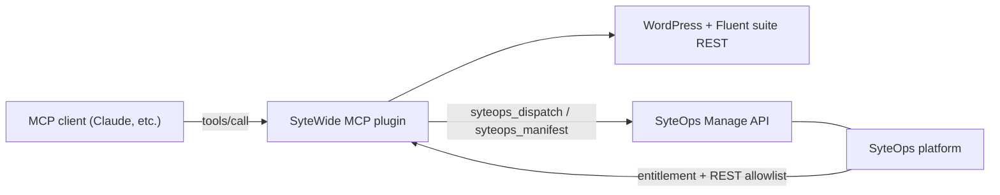

# Using the API via MCP

The SyteOps Manage API has two entry points: direct HTTP calls (covered in the [Manage API overview](../api/overview)) and the **MCP path** described here. The MCP path lets an AI client — Claude, a custom agent, or any MCP-compatible tool — call the Manage API as ordinary tool invocations, with no HTTP client code required.

## Using the Manage API through the MCP

The SyteWide MCP plugin exposes two tools that map directly onto Manage API endpoints:

- **`syteops_manifest`** calls `GET /syteops/v1/manage/manifest` and returns the full catalog of resources and actions the running SyteOps instance supports. Use it to discover what is available before committing to an action.
- **`syteops_dispatch`** calls `POST /syteops/v1/manage/dispatch` to execute a specific `{ resource, action, params }` triplet. Destructive operations additionally require `confirm: true` in the body. The response is always the same `{ ok, data, changed, error }` envelope, regardless of which action was dispatched.

The recommended pattern in any automated flow is **manifest first, dispatch second**: pull the manifest to confirm that the target resource and action exist, then dispatch with confidence.

### Dispatch body and response

```json
{
  "resource": "plugins",
  "action": "deactivate",
  "params": {
    "slug": "some-plugin"
  },
  "confirm": true
}
```

```json
{
  "ok": true,
  "data": { "status": "inactive" },
  "changed": true,
  "error": null
}
```

## Gating — how SyteOps controls MCP access

:::note SyteOps gates the MCP plugin
The relationship runs in both directions. SyteOps does not just receive calls from the MCP — it also controls whether the MCP is allowed to operate at all.

When the `syteops_sytewide_mcp` entitlement module is active inside SyteOps, the platform adds the route prefix `/wp-json/sytewide-mcp/v1/*` to its REST allowlist. Only then can MCP tool calls reach WordPress REST endpoints on that site.

Additionally, the SyteWide MCP plugin is a **regulated plugin**: its installation folder must not be renamed. SyteOps uses the fixed folder name to identify and manage the plugin internally.
:::

## Stack diagram



## Related pages

- [MCP overview](../mcp/overview) — connecting an MCP client to a WordPress site
- [The SyteOps bridge](../mcp/syteops-bridge) — the MCP-side view of the two bridge tools and a step-by-step usage example
