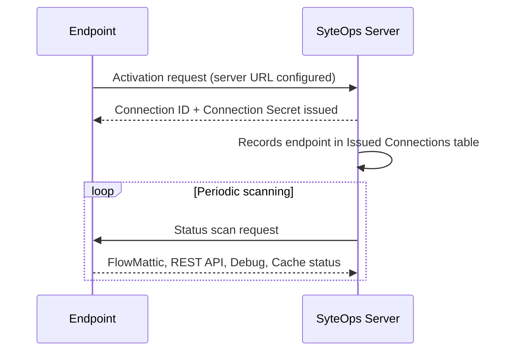

# Server Connections

Server Connections allow a SyteOps **Server** to remotely manage multiple SyteOps **Endpoints**. This is separate from your Product License — both the server and each endpoint need their own valid Product License, but the connection system operates independently.

## Server Mode vs Endpoint Mode

- **Server mode** — The central site that manages other sites. Issues connection IDs and performs remote actions.
- **Endpoint mode** — A managed site that receives commands from a server. Activates using a Connection ID provided by the server.

## Architecture Overview

A single SyteOps Server can manage multiple Endpoints. The server polls each endpoint periodically to collect status information and push remote actions.

## How Connections Work

1. An endpoint enters the server's URL during Initial Setup or in the Admin tab
2. The endpoint activates, which sends a request to the server
3. The server automatically issues a **Connection ID** and **Connection Secret**
4. The connection appears in the server's **Issued Connections** table
5. The server can now monitor and manage the endpoint remotely

### Connection Establishment Flow

## Issued Connections Table

The server displays all connections in the Issued Connections table, showing:

- **Endpoint domain** — The connected site's URL
- **Connection status** — Active, Disconnected, Revoked, or Ready
- **Endpoint status badges** — Current state of FlowMattic, REST API, Debug Mode, and logging on the endpoint
- **Last checked** — How long since the server last scanned the endpoint (e.g., "5m ago")

Use the **Refresh** button on each connection to update the endpoint's status.

## Connection Actions

Each connection has a dropdown menu with available actions, organized by category.

### Standard Actions

| Action | Description |
|---|---|
| **Retry Connection** | Re-establish a disconnected connection |
| **Edit Users** | Manage user settings on the endpoint |

### REST API Actions

| Action | Description |
|---|---|
| **REST API: Restrict** / **Unrestrict** | Toggle REST API restriction on the endpoint |
| **REST API: Manage Allowlist** | Add or remove custom allowlist paths on the endpoint |
| **REST API: Enable/Disable Logging** | Toggle REST monitoring on the endpoint |

The Manage Allowlist action is hidden when the endpoint's REST API is unrestricted.

### Debug Actions

| Action | Description |
|---|---|
| **Debug: Enable/Disable SyteOps** | Toggle SyteOps Debug Mode on the endpoint |
| **Debug: Enable/Disable WordPress** | Toggle WordPress debug logging on the endpoint |

### Logging Actions

| Action | Description |
|---|---|
| **Logging: Purge SyteOps** | Delete SyteOps debug logs on the endpoint |
| **Logging: Purge WordPress** | Delete the WordPress debug.log on the endpoint |

### FlowMattic Actions

These actions only appear when FlowMattic is detected on the endpoint.

| Action | Description |
|---|---|
| **FlowMattic: License** | Activate a FlowMattic license on the endpoint |
| **FlowMattic: Revoke License** | Revoke the FlowMattic license on the endpoint |
| **FlowMattic: Manage Workflows** | Import or manage workflows on the endpoint |
| **FlowMattic: Check Updates** | Check for integration updates on the endpoint |

### Plugins Actions

| Action | Description |
|---|---|
| **Plugins: Manage** | Enable or disable plugins on the endpoint |

### Cache Actions

| Action | Description |
|---|---|
| **Purge LiteSpeed Cache** | Clear the LiteSpeed cache on the endpoint (only available when LiteSpeed Cache is active) |

### Danger Zone

These actions are destructive and appear at the bottom of the dropdown.

| Action | Description |
|---|---|
| **Plugins: Delete** | Permanently remove plugins from the endpoint |
| **Revoke SyteOps** | Disconnect and disable SyteOps on the endpoint |
| **Uninstall SyteOps** | Remove SyteOps and restricted plugins from the endpoint |
| **Delete Connection** | Remove this connection from the server's list |

All danger zone actions require confirmation before executing.

## Bulk Actions

Select multiple connections and apply actions in bulk using the action dropdown at the top of the table. Bulk actions run concurrently with progress tracking.

## Endpoint Scanning

When the server scans an endpoint, it checks:
- FlowMattic license status and version
- REST API restriction state
- Debug mode status
- REST monitoring status
- Active cache plugins

The results appear as status badges next to each connection.

## Troubleshooting

**Endpoint shows "Disconnected":**
The server cannot reach the endpoint. Check that the endpoint is online and that firewall rules (including Cloudflare) allow server-to-server requests. Use **Retry Connection** to re-establish.

**Actions dropdown is disabled:**
The endpoint URL or domain is missing from the connection. The endpoint needs to complete activation with the server URL configured.

**FlowMattic actions not showing:**
FlowMattic actions only appear when the server detects FlowMattic on the endpoint. Refresh the connection status to update detection.
