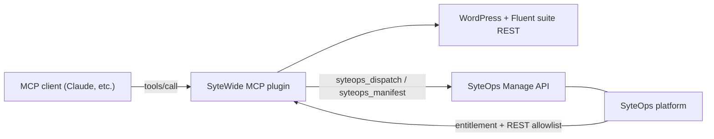

# Overview

## What SyteWide MCP is

SyteWide MCP is a WordPress plugin that exposes WordPress core, the Fluent suite, FlowMattic, and Squirrly SEO as **MCP (Model Context Protocol) tools**. Any MCP-compatible client — such as Claude — can call those tools directly to read and write data on a WordPress site without building custom integrations.

The covered surface includes:

- **WordPress core** — content types, taxonomies, media, users, comments, plugins
- **Fluent suite** — CRM, Cart (ecommerce), Booking, Forms, SMTP, Affiliate, Community, and Support
- **FlowMattic** — workflow automation
- **Squirrly SEO** — SEO metadata, redirects, JSON-LD, and audits

Tools are organized into 18 providers. The complete catalog contains **386 tools**; a typical fully-loaded site exposes **~297**, because the tool surface adapts per site (see below).

## The provider-detection model

Each provider implements an `is_available()` check. When the MCP plugin loads, it asks every provider whether its underlying plugin is installed and active. Providers whose dependency is absent are silently omitted from `tools/list` and `tools/call`.

This means the live tool count is **per-site**: a site running only WordPress core and FluentCRM will expose a much smaller set than a site running the full Fluent suite plus FlowMattic and Squirrly SEO. You do not need to configure which providers are active — detection is automatic.

To inspect the live count for a connected site, call the `sytewide_get_status` tool; it returns the current registry size. See [Connecting a client](./connecting) for how to establish a connection.

## Footprint

| Dimension | Value |
|-----------|-------|
| Catalog (all providers present) | 386 tools |
| Typical fully-loaded site | ~297 tools |
| Providers | 18 |
| MCP protocol version | 2024-11-05 (cursor-paginated `tools/list`) |

## Gated by SyteOps

SyteWide MCP is a **regulated plugin** managed by the SyteOps platform:

- The `syteops_sytewide_mcp` entitlement module must be active on the site.
- SyteOps adds `/wp-json/sytewide-mcp/v1/*` to its REST allowlist; without this, the MCP endpoint is inaccessible.
- The plugin folder cannot be renamed — SyteOps references it by its fixed slug.
- Provisioning and dispatch flow through the [SyteOps Manage API](../api/overview).

Next: [Connecting a client](./connecting).
