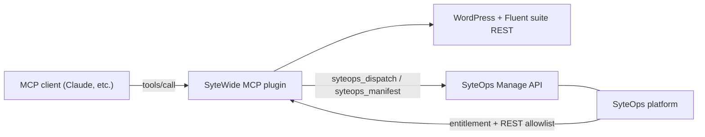

# The SyteOps bridge

The SyteWide MCP plugin is not limited to the Fluent suite REST endpoints. It also carries two tools that speak directly to the **SyteOps Manage API**, giving an MCP client (Claude, a custom agent, etc.) the ability to inspect and control anything SyteOps manages — without ever leaving the tool-call interface.

## How the MCP reaches SyteOps

Two tools bridge the gap:

| MCP tool | Manage API endpoint | Purpose |
|---|---|---|
| `syteops_manifest` | `GET /syteops/v1/manage/manifest` | Discover every resource and action SyteOps currently exposes |
| `syteops_dispatch` | `POST /syteops/v1/manage/dispatch` | Execute a specific resource/action pair with optional params |

The tools call those endpoints on the same WordPress site where the MCP plugin is installed. No additional credentials or network paths are required.

## A typical flow

The intended usage is a two-step pattern: **discover, then act**.

1. Call `syteops_manifest` — it returns the full list of available resources and the actions each one accepts. This lets the AI (or calling code) know what operations are possible before committing to one.
2. Call `syteops_dispatch` with the chosen resource, action, and any parameters.

### Dispatch call shape

The body sent to the Manage API by `syteops_dispatch` looks like this:

```json
{
  "resource": "plugins",
  "action": "activate",
  "params": {
    "slug": "fluent-crm"
  }
}
```

The API responds with a uniform envelope:

```json
{
  "ok": true,
  "data": { "status": "active" },
  "changed": true,
  "error": null
}
```

:::warning Destructive operations
Actions that are irreversible (deletions, resets, etc.) require an extra `confirm: true` field in the dispatch body. Omitting it will cause the API to reject the request rather than proceed.
:::

:::tip Discover before dispatching
Always call `syteops_manifest` first in an automated flow. The manifest is the authoritative source of which `resource` / `action` pairs are valid — hard-coding them risks calling an action that has been renamed or removed.
:::

## Stack diagram



## Related pages

- [Manage API overview](../api/overview) — full reference for the Manage API, including authentication and error codes
- [Manage API reference](../api/reference/) — per-resource and per-action documentation
